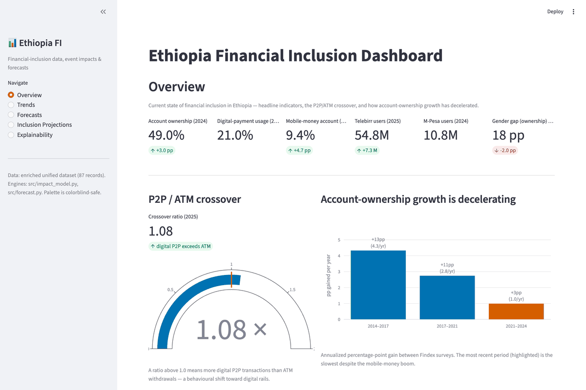

# Ethiopia Financial Inclusion Forecast

[](https://github.com/BytePhilosopher/ethiopia-fi-forecast/actions/workflows/unittests.yml)
[](https://www.python.org/downloads/)
[](tests/)

Forecasts Ethiopia's financial-inclusion **Access** and **Usage** indicators to 2027 from a
sparse, event-annotated time series — and explains *why* the mobile-money boom added
65 million wallets but almost no new account-holders.

---

## Business Problem

Between 2021 and 2024 Ethiopia's operators registered **more than 65 million mobile-money
accounts**. Telebirr alone passed 54 million users; M-Pesa added 10 million more.

Over the same window, the share of Ethiopian adults owning *any* account — bank or wallet —
moved from **46% to 49%**. Three percentage points, during the largest financial-services
push in the country's history.

That gap is an expensive problem for anyone allocating capital here:

- **Registration counts overstate inclusion by roughly 8–10×.** A donor, regulator or investor
  tracking wallet sign-ups as a KPI is measuring marketing reach, not financial inclusion.
- **Official targets were set against the wrong curve.** Ethiopia's NFIS-II strategy targets
  **70% ownership by 2025**. Nothing in the observed trajectory supports it, so programmes
  anchored to that number are budgeting against a plan that cannot land.
- **Impact estimates borrowed from Kenya or India do not transfer.** Applied naively to
  Ethiopia they over-predict ownership by **13.7 percentage points**.

The consortium behind this work needed a defensible answer to three questions: where will
inclusion actually be in 2027, which events genuinely move it, and how much confidence
should anyone place in the answer.

## Solution Overview

The hard constraint is data sparsity: 87 records, and only 7 of the 30 observed indicators span
two or more years. Classical per-indicator time-series modelling is not viable. So instead of forcing a
model onto four Findex data points, the approach models the **events** and their transfer to
Ethiopian conditions.

1. **A unified, event-annotated schema.** Observations, events, modelled `impact_link`s and
   policy targets share one structure. Events are deliberately kept *pillar-neutral* — a
   product launch affects both access and usage, and the schema refuses to pre-judge which.
   Effects exist only as explicit, sourced `impact_link` records.
2. **An event-impact engine.** Each link gets a half-life effect ramp
   `g(Δt) = 1 − 0.5^(Δt/lag)`, so effects build gradually. Links combine additively for
   percentage-point indicators and multiplicatively for counts.
3. **Empirical calibration.** The naive model is validated against held-out history, which is
   where the transfer bias shows up: it over-predicts 2024 ownership by 13.7pp. An attenuation
   factor **α ≈ 0.18** — only 18% of borrowed effect materialises in Ethiopia — is fitted, not
   assumed.
4. **Three forecast methods, with honest uncertainty.** A linear trend + 95% prediction
   interval for statistical uncertainty; an event-augmented scenario model for structural
   uncertainty; and an ownership × payment-propensity decomposition for digital payments,
   which has only a single observed data point.
5. **Explainability, not a black box.** The forecast is additive by construction, so
   attribution is *exact* rather than approximated. SHAP on a surrogate model audits what
   drives the impact estimates themselves — and surfaces a bias in the knowledge base.

## Key Results

| Result | Value | Why it matters |
|---|---|---|
| **Transfer bias eliminated** | 13.7pp error → **0.0pp** on validation | Naive comparable-country estimates predicted 62.7% ownership for 2024 against 49% observed. Calibrating α = 0.18 reproduces the observed value. |
| **Uncertainty made usable** | 46.7pp → **6.4pp** band (−86%) | The linear 95% PI for 2027 spans 36.3–83.0% — statistically valid, structurally absurd. The scenario band gives 51.5–57.9%, bounds a programme can actually plan against. |
| **Validated on a second indicator** | **5.7%** error, uncalibrated | Mobile-money ownership predicted 8.91% vs 9.45% observed — with *no* attenuation, confirming the bias is specific to headline ownership, not the method. |
| **NFIS-II 70% target: unreachable** | base **54.4%** by 2027 (15.6pp short) | Reached on *no* scenario, including optimistic (57.9%). Quantifies a shortfall that was previously assumed away. |
| **Consortium 60% target: at risk** | optimistic **57.9%** | Missed even on the optimistic path — actionable early warning. |
| **Digital payments** | **26.6%** by 2027 (22.9–31.9%) | Usage keeps growing off a low base while ownership stalls. |
| **Binding constraint identified** | phone **41%**, smartphone **40%** | Not account supply. The 15pp gender ownership gap tracks a 17pp phone-ownership gap — inclusion cannot outrun device access. |
| **Dataset enrichment** | 57 → **87 records** (+53%) | 30 additions, each with source URL, exact quote, confidence and rationale; one systematic column-alignment defect corrected. |
| **Engineering** | **75 tests**, CI on every push | Including tests that the *explanation is faithful*, not merely that code runs. |

> **On the headline number.** The base case is ~54% ownership by 2027, not a dramatic
> breakthrough. The value here is the opposite of a bullish forecast: it shows the official
> target is unreachable, explains precisely why, and identifies the constraint (devices) that
> would have to move first.

## Quick Start

```bash
git clone https://github.com/BytePhilosopher/ethiopia-fi-forecast
cd ethiopia-fi-forecast
pip install -r requirements.txt

# Launch the interactive dashboard — the fastest way to see everything
streamlit run dashboard/app.py          # http://localhost:8501
```

Reproduce the analysis from raw data:

```bash
python src/build_processed_dataset.py   # raw -> corrected + enriched dataset
python -m src.load_data                 # load & summarise

# Regenerate every figure (run as modules — they import the src package)
python -m src.eda                       # EDA figures            (01-11)
python -m src.impact_model              # impact model + validation (12-14)
python -m src.forecast                  # forecasts + CSV table  (15-16)
python -m src.explain                   # attribution + SHAP     (17-19)

pytest -q                               # 75 tests
```

**Requires Python 3.11+.** The dashboard screenshots and demo GIF are regenerated with
`python scripts/capture_dashboard.py` (additionally needs `playwright install chromium`).

## Project Structure

```
ethiopia-fi-forecast/
├── data/
│   ├── raw/                    # faithful CSV of the starter workbook — never edited
│   └── processed/              # analysis-ready enriched dataset + forecast table (generated)
├── src/
│   ├── config.py               # frozen dataclasses: every model constant & assumption
│   ├── utils.py                # shared helpers: palette, time deltas, half-life ramp
│   ├── load_data.py            # loading / record-type splitting
│   ├── build_processed_dataset.py   # raw -> processed build (correction + enrichment)
│   ├── eda.py                  # EDA figure engine
│   ├── impact_model.py         # event -> indicator impact engine + validation
│   ├── forecast.py             # 2025-2027 forecast engine (3 methods)
│   ├── explain.py              # exact attribution + SHAP explainability
│   └── build_*_notebook.py     # notebook generators (narrative stays in sync with code)
├── dashboard/
│   ├── app.py                  # Streamlit app — 5 pages
│   └── data_access.py          # pure data helpers (no Streamlit imports)
├── tests/                      # 75 tests, run in CI on every push
├── notebooks/                  # 01_eda · 02_impact_model · 03_forecast (executed)
├── reports/
│   ├── final_report.md         # the full write-up
│   ├── figures/                # 19 analysis figures + dashboard/ screenshots & demo GIF
│   └── *.md                    # data quality, EDA insights, methodology, interpretation
├── scripts/capture_dashboard.py     # headless screenshot + GIF capture
├── data_enrichment_log.md      # every added record: URL, quote, confidence, rationale
└── .github/workflows/unittests.yml  # CI
```

## Demo



Run it locally with `streamlit run dashboard/app.py`. Five pages:

| Page | What you can do |
|---|---|
| **Overview** | Headline metric cards, the P2P/ATM crossover gauge, growth-deceleration chart |
| **Trends** | Pick indicators, set a year range, compare channels (P2P vs ATM, Telebirr vs M-Pesa), download the data |
| **Forecasts** | Switch between event-augmented scenarios / linear trend+PI / both; projected milestones; association heatmap; download the forecast table |
| **Inclusion Projections** | Scenario selector, progress-toward-60%-target gauge, plain-language answers to the consortium's questions |
| **Explainability** | Attribution waterfall per scenario, SHAP global importance, download the attribution table |

Full-resolution stills are in [`reports/figures/dashboard/`](reports/figures/dashboard/).

## Technical Details

### Data

- **Source:** a unified, event-annotated starter workbook of Ethiopian financial-inclusion
  records (57 rows), enriched to **87** — 50 observations, 13 events, 21 impact_links and
  3 targets, covering 30 observed indicators.
- **Preprocessing:** the raw CSV is never edited. `src/build_processed_dataset.py` applies one
  systematic correction (the starter file's documentation columns were shifted one position, so
  `comparable_country` held the collector's name and `collected_by` held a date) plus 30 sourced
  additions. Every change is logged with a source URL, exact quote, confidence rating and
  rationale in [`data_enrichment_log.md`](data_enrichment_log.md).
- **Primary sources:** World Bank Global Findex (2014–2024), National Bank of Ethiopia,
  operator reports (Ethio Telecom / Safaricom Ethiopia), GSMA, ITU.
- **Known limits:** 77% of indicators are single-year snapshots; non-overlapping years make
  direct cross-indicator correlation spurious, which is why relationships are read from
  explicit impact links rather than computed from co-movement. See
  [`reports/data_quality_assessment.md`](reports/data_quality_assessment.md).

### Models

**1. Event-impact engine** ([`src/impact_model.py`](src/impact_model.py)) — the core contribution.

Effect realised `Δt` months after an event, where `L` is the half-life in months:

```
g(Δt) = 1 − 0.5^(Δt / L)        for Δt ≥ 0, else 0
g(L) = 0.50,  g(2L) = 0.75,  g(3L) = 0.875  →  asymptotes to the full effect
```

`L` itself encodes how gradual an effect is (direct launches 3–6 months, enabling policies
15–36), so no extra relationship-type term is needed. Combination is unit-aware:

```
additive        (percentage, gap_pp):  level(t) = anchor + Σ Mᵢ·[gᵢ(t) − gᵢ(t_anchor)]
multiplicative  (count, currency, ratio): level(t) = anchor · Π (1 + (Mᵢ/100)·[gᵢ(t) − gᵢ(t_anchor)])
```

Effects are measured as an increment *relative to the anchor date*, so events that began before
the anchor are not double-counted.

**2. Forecast engine** ([`src/forecast.py`](src/forecast.py)) — three methods:

| Method | Purpose | Key parameters |
|---|---|---|
| Linear trend + 95% PI | Statistical uncertainty; deliberately naive baseline | OLS on 4 Findex points, slope **2.71 pp/yr**, t-interval with n−2 df |
| Event-augmented scenarios | Central forecast | organic drift **0.5 / 1.2 / 2.0** pp/yr, attenuation α **0.10 / 0.18 / 0.30** (pessimistic/base/optimistic) |
| Ownership × propensity | Digital payments (one observed point) | 2024 propensity 21/49 = **0.429**, rising to 0.445–0.550 by 2027 by scenario |

All constants live in frozen dataclasses in [`src/config.py`](src/config.py) — nothing is
hardcoded at a call site.

**3. SHAP surrogate** ([`src/explain.py`](src/explain.py)) — `RandomForestRegressor`,
`n_estimators=300`, `max_depth=4`, `random_state=0`, explained with `TreeExplainer`.

### Evaluation

Validation is **out-of-sample in time**: anchor the model at the 2021 Findex observation,
predict 2024, compare against the held-out actual.

| Indicator | Anchor (2021) | Predicted (naive) | Observed 2024 | Error | After calibration |
|---|---|---|---|---|---|
| `ACC_OWNERSHIP` | 46.0% | 62.66% | 49.0% | **+13.66pp** | 49.0% (α = 0.18) |
| `ACC_MM_ACCOUNT` | 4.7% | 8.91% | 9.45% | **−0.54pp** (−5.7%) | — (α = 1.0, uncalibrated) |

The second row is what makes the first credible: the same engine, unmodified, predicts
mobile-money ownership to within 5.7%. The bias is specific to headline ownership — borrowed
estimates assume new users, while Ethiopia's wallets went to people who already had accounts.

**Uncertainty is reported two ways** rather than collapsed into one number: the linear 95% PI
(statistical) and the optimistic–pessimistic scenario band (structural). Where they disagree is
itself informative — the PI's 36.3–83.0% range for 2027 shows how little four data points
constrain a linear extrapolation.

**Explainability is tested, not just plotted.** Two tests check the explanation is *correct*:

- `test_contributions_sum_to_the_actual_forecast` — attribution is computed independently of
  the forecast engine, so requiring the two to agree proves the waterfall explains the real
  model rather than a re-implementation that has drifted from it.
- `test_shap_values_satisfy_additivity` — asserts SHAP's own guarantee,
  `base value + Σ shap == model prediction`.

**Two concerning patterns the SHAP analysis surfaced** — reported rather than buried:

1. **Provenance predicts magnitude.** `evidence_basis` is among the strongest drivers of how
   large an effect a link is credited with. How a number was sourced explains its size better
   than what the event was — a bias signal in the knowledge base, not a finding about
   Ethiopian households.
2. **The surrogate is leverage-dominated.** It fits only the 13 percentage-point-denominated
   links (a `count` row's estimate is percent *growth*, so mixing units would let a dimensional
   artifact drive the ranking), and on 13 curated rows the ordering is unstable:
   `pillar_AFFORDABILITY` leads largely because two `AFF_DATA_INCOME` links (+30pp, −20pp) are
   the most extreme rows present. The dashboard labels the chart accordingly, and the tests
   deliberately assert structural guarantees rather than pinning a winning feature — a test
   that pinned it would encode noise as a requirement.

### Engineering

- **Typed configuration objects** — frozen dataclasses (`ImpactConfig`, `ForecastConfig`,
  `Scenario`, `EdaConfig`) as singletons. Frozen means a stray write cannot silently change
  every downstream figure; `dataclasses.replace()` gives cheap sensitivity analysis.
- **Magic numbers named** with provenance recorded next to them. The EDA engine and the impact
  engine read the *same* magnitude maps, so the association heatmap cannot disagree with the
  model that produced it.
- **Type hints on every signature** in `src/` and `dashboard/` (AST-verified).
- **CI installs from `requirements.txt`** rather than a hand-listed package set, so a
  dependency added to the project cannot go missing from the pipeline.

Test coverage by area:

| File | Covers |
|---|---|
| [`test_data_integrity.py`](tests/test_data_integrity.py) | schema, record-type invariants, pillar-neutrality of events |
| [`test_eda_smoke.py`](tests/test_eda_smoke.py) | figures build; growth-deceleration regression |
| [`test_impact_model.py`](tests/test_impact_model.py) | effect ramp, additive vs multiplicative combination, validation |
| [`test_forecast.py`](tests/test_forecast.py) | trend slope & prediction interval, scenario ordering, decomposition |
| [`test_dashboard.py`](tests/test_dashboard.py) | app smoke tests via Streamlit `AppTest` |
| [`test_utils.py`](tests/test_utils.py) | half-life ramp properties, time deltas, palette, series lookup |
| [`test_config.py`](tests/test_config.py) | config immutability + internal consistency of assumptions |
| [`test_explain.py`](tests/test_explain.py) | attribution faithfulness, SHAP additivity, unit coherence |

## Documentation

| Document | Contents |
|---|---|
| [`reports/final_report.md`](reports/final_report.md) | The full narrative write-up, end to end |
| [`reports/eda_key_insights.md`](reports/eda_key_insights.md) | 6 insights + hypotheses |
| [`reports/data_quality_assessment.md`](reports/data_quality_assessment.md) | Completeness, reliability, known defects |
| [`reports/impact_model_methodology.md`](reports/impact_model_methodology.md) | Functional form, sources, validation, uncertainties |
| [`reports/forecast_interpretation.md`](reports/forecast_interpretation.md) | What the forecasts mean for policy |
| [`data_enrichment_log.md`](data_enrichment_log.md) | Every added record with URL, quote, confidence, rationale |
| [`data/README.md`](data/README.md) | Full schema reference |

## Future Improvements

**Data — the binding constraint.** Everything else is downstream of having more than four
Findex points.

- Pull the **Findex 2025 microdata** for rural/urban and youth cuts. No rural/urban
  disaggregation exists in the current dataset, and it is almost certainly where the real
  variation lives.
- Add a genuine **Telebirr → mobile-money-account** impact link. Much of the 2021–2023 growth
  predates M-Pesa and is currently mis-attributed.
- Bring in **NBE complaints data** to populate the trust dimension, which is entirely unmeasured.
- Track **phone and smartphone ownership as leading indicators** — if the device gap is the
  ceiling, it should be the headline KPI, not a footnote.

**Modelling.**

- Replace the single global α with **per-pillar or per-event-type attenuation**, once enough
  validation intervals exist to fit them without overfitting. α currently rests on one interval.
- Add a **saturation term**. The linear trend's 83% upper bound for 2027 is not credible; a
  logistic form with a device-access ceiling would encode what we already know.
- **Backtest on a rolling origin** once a fifth Findex wave lands, to get a real error
  distribution instead of a single held-out point.
- Widen the SHAP surrogate to all impact links by **normalising effects into a common unit**,
  which would let count-denominated links back in without the dimensional artifact.

**Engineering.**

- Deploy the dashboard to **Streamlit Community Cloud** so the demo is a live link.
- Add **`mypy --strict`** to CI; the annotations are all present but unchecked.
- Cache the SHAP surrogate to disk — it refits on every cold dashboard load.

## Limitations

Stated plainly, because they bound how the results should be used:

- **Four data points.** The ownership forecast rests on four Findex observations. No amount of
  method compensates for that.
- **α ≈ 0.18 rests on a single calibration interval.** If Ethiopia starts reaching genuinely
  new users, ownership could rise faster than the base case.
- **The digital-payment forecast rests on one observed point** — the widest uncertainty here.
- **Long-lag policies aren't yet observable.** Foreign-bank entry, EthioPay and the
  M-Pesa–EthSwitch integration are too recent for their real magnitudes to be tested.
- **The SHAP surrogate is illustrative, not inferential** — 13 curated records are enough to
  audit the knowledge base for bias, nowhere near enough to claim which event *types* work.

## Author

**Yostina Abera**

- LinkedIn: [yostina-abera](https://www.linkedin.com/in/yostina-abera-70b7a2261/)
- GitHub: [@BytePhilosopher](https://github.com/BytePhilosopher)

## Data attribution

Underlying data belongs to its original publishers — World Bank Global Findex, National Bank of
Ethiopia, GSMA, ITU, and the named operators. Per-record attribution, including source URLs and
exact quotes, is in [`data_enrichment_log.md`](data_enrichment_log.md).
