# Ethiopia's Financial-Inclusion Paradox: 65 Million Mobile Wallets, and Almost No New Account-Holders

### What a sparse, event-annotated dataset reveals about who Ethiopia's digital-payment revolution actually reached — and where inclusion is headed by 2027.

*By Yostina Abera*

---

Between 2021 and 2024, Ethiopia's mobile-money providers registered more than **65 million accounts**. Telebirr alone crossed 54 million users; M-Pesa added another 10 million. It looked like a revolution.

And yet, over the exact same window, the share of Ethiopian adults who own *any* account — a bank account or a mobile wallet — rose from **46% to just 49%**. Three percentage points. During the biggest financial-services push in the country's history.

That contradiction is the puzzle at the heart of this project. Solving it changes how you read every number in Ethiopia's inclusion story, and it reshapes any forecast you'd dare to make. This post walks through the whole analysis — from a messy 57-row starter dataset to an interactive forecasting dashboard — and explains what the paradox means for the 2025–2027 outlook.

---

## Executive summary

- **Access has plateaued.** Account ownership grew only +3pp (2021→2024), decelerating from ~+4pp/yr a decade ago to ~+1pp/yr today — *despite* 65M+ mobile-money registrations.
- **The paradox is a measurement-and-market-structure effect, not a data error.** Mobile-money-*only* users are ~0.5% of adults and bank accounts are already easily accessible, so the registrations mostly went to people who **already had an account**. Findex counts *any* account, so they barely move the headline.
- **Usage is going digital even though access stalled.** Person-to-person (P2P) transactions overtook ATM withdrawals in 2024→2025 (+158% in a year). The frontier moved from *owning* an account to *transacting* on one.
- **An event-impact model, validated against history, quantifies the gap.** Impact estimates borrowed from Kenya/India over-predict Ethiopian ownership by ~14 points; only **~18%** of their nominal effect materialises here.
- **Forecast to 2027 (base case): ownership ~54%, digital payments ~27%.** The NFIS-II 70% target is unreachable; the consortium's 60% target is only reached on an optimistic path.
- **The binding constraint is demand-side device access** — phone ownership (41%) and smartphone adoption (40%) — not the supply of accounts.

Everything below is reproducible: an enriched dataset, three Jupyter notebooks, a tested Python modelling library, and a Streamlit dashboard.

---

## Data and methodology

The starting point was a **unified, event-annotated dataset** of Ethiopian financial-inclusion records. Its clever design principle: rather than force every fact into a rigid table, all records share one schema and a `record_type` field says how to read each row —

- **`observation`** — a measured value (a Findex survey point, an operator report, an infrastructure figure);
- **`event`** — a policy, product launch, or milestone, deliberately left *pillar-neutral* (no pre-assigned interpretation);
- **`impact_link`** — a modelled relationship connecting an event to an indicator, with a direction, magnitude, lag, and evidence basis;
- **`target`** — an official policy goal.

Keeping events pillar-neutral and expressing their effects only through `impact_link` records is what keeps the data unbiased — a launch like Telebirr affects *both* access and usage, and the schema refuses to pretend otherwise.

**Enrichment (Task 1).** I grew the dataset from **57 to 87 records** and fixed one systematic data-quality defect (the starter file's documentation columns were shifted one position, so `comparable_country` held the collector's name and `collected_by` held a date). The 30 additions — each with a source URL, an exact quote, a confidence rating, and a rationale — added: Findex 2025 gender and depth detail; a **four-point Telebirr adoption series** (the only usable multi-year usage curve); infrastructure and agent-network figures (ATMs, POS, ~216k agents averaging fewer than one transaction a day); enabler proxies (smartphones, electricity); three foundational events (the 2020 Payment Instrument Issuers Directive, the National Digital Payments Strategy, the 2024 foreign-bank proclamation); and seven impact links — including two that connect NFIS-II to the very targets it governs.

**The analytical stack.** Everything downstream is generated, not hand-edited: a raw→processed build script applies the correction and enrichment; a loader and an EDA engine produce every figure; an impact-model library implements the event mathematics; a forecasting module projects the two targets; and a Streamlit app ties it together. Seventy-five automated tests guard the whole chain, and continuous integration runs them on every push. Charts use a colorblind-safe palette and avoid dual-axis traps by construction.

---

## Key insights from exploratory analysis

### 1. Ownership stalled just as the mobile-money boom peaked

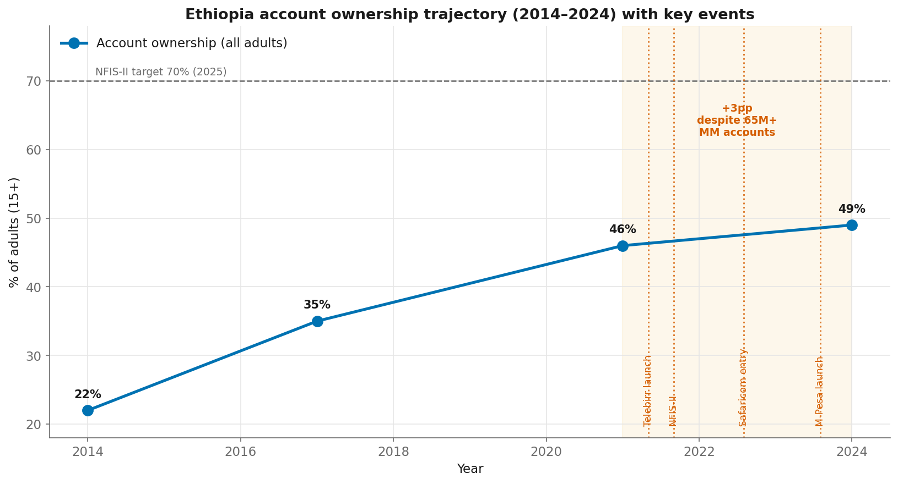

The trajectory tells the story at a glance: steep gains through 2017, still-healthy growth to 2021, then a near-flat line through the Telebirr and M-Pesa era. Annualised, the gain fell from **+4.3pp/yr (2014–17)** to **+1.0pp/yr (2021–24)**.

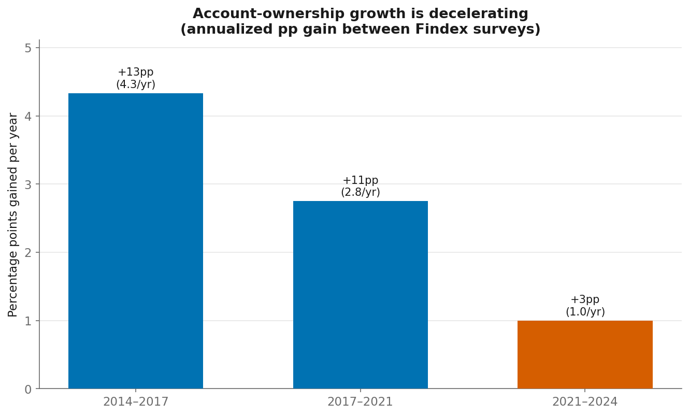

### 2. The paradox, visualised

Here is the contradiction in one pair of panels — 55 million operator registrations next to a survey-measured mobile-money ownership rate of 9.45%:

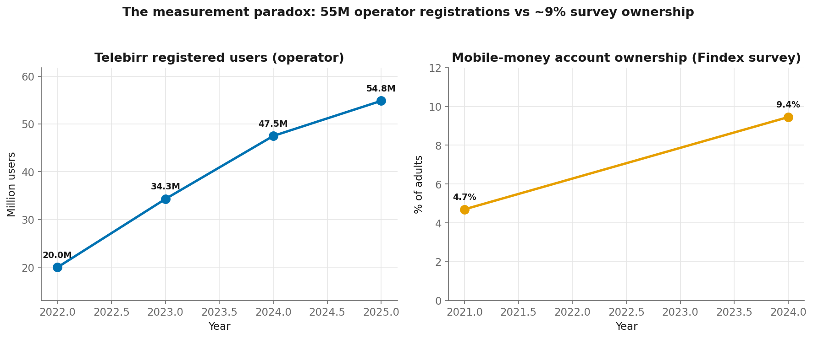

The resolution comes from Ethiopia's specific market structure. Bank accounts are already easily accessible, and **mobile-money-*only* users are about 0.5% of adults**. So when 65 million wallets were opened, most went to people who already held an account. They gained a convenient payment rail — not membership in the "banked" population that Findex measures.

### 3. Registered ≠ active ≠ unique owner

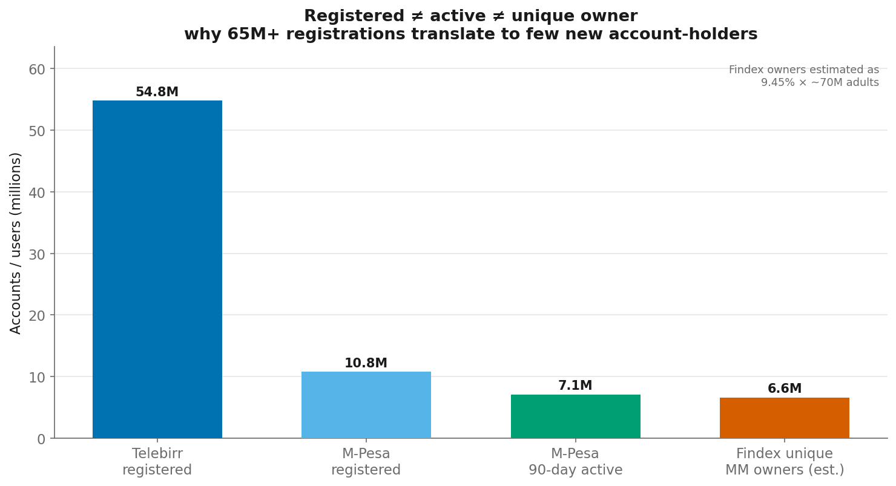

Operator counts overstate inclusion roughly **eight- to ten-fold**. M-Pesa's 90-day *active* rate is 66%; the ~216,000 agents average fewer than one transaction per day. Any KPI built on registration counts is measuring sign-ups, not inclusion.

### 4. Usage went digital anyway

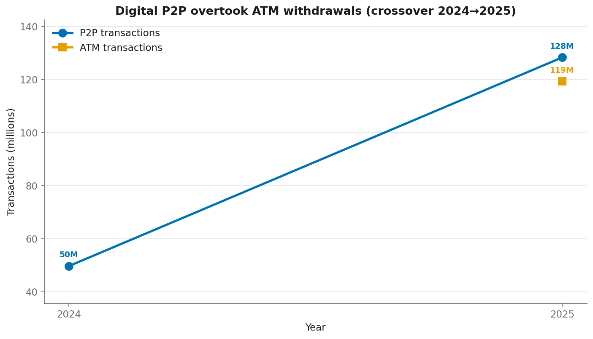

Even as *ownership* flatlined, *behaviour* shifted decisively: digital P2P transactions (much of it merchant commerce, not just transfers) overtook ATM withdrawals — 49.7M → 128.3M in a single year.

### 5. The gender gap is really a device gap

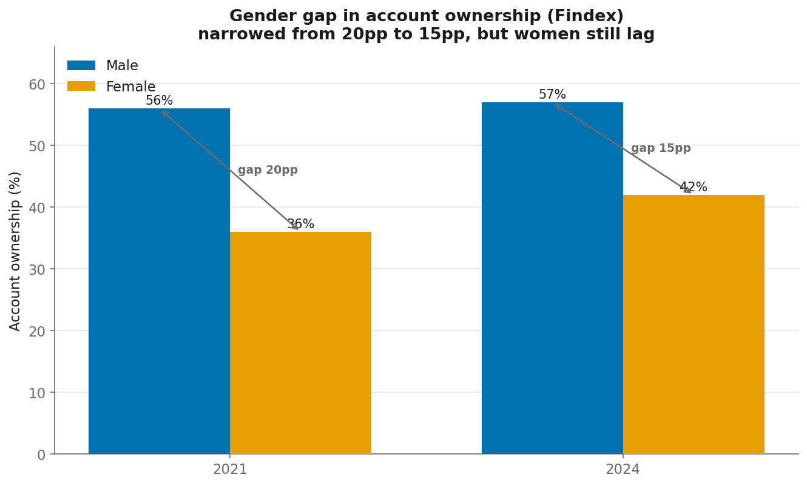

The ownership gap narrowed from ~20pp to ~15pp (men 57%, women 42%), but it closely tracks a **17-point phone-ownership gap** (men 50%, women 33%). You cannot close the account gap without closing the device gap first.

### 6. Enablers are the ceiling

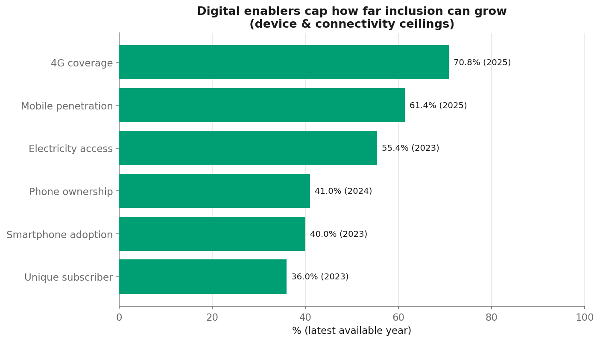

4G coverage nearly doubled (37.5%→70.8%), but phone ownership (41%) and smartphone adoption (40%) lag far behind. Connectivity supply has run ahead of device demand — and devices, not networks, are now the true ceiling on inclusion.

---

## The event-impact model: methodology and results

The dataset says *which* events affect *which* indicators. The modelling task was to turn those qualitative links into something that predicts *how much* an indicator moves, and *when*.

**How an effect unfolds over time.** Effects build gradually, not instantly. I model the fraction of a link's full effect realised `Δt` months after the event as a half-life saturating ramp:

> **g(Δt) = 1 − 0.5^(Δt / lag)**

so the `lag` is the time to reach *half* the full effect, and the response asymptotes smoothly to its maximum. Direct product launches carry short lags (fast); enabling policies carry long lags (slow). The lag itself encodes how gradual the response is.

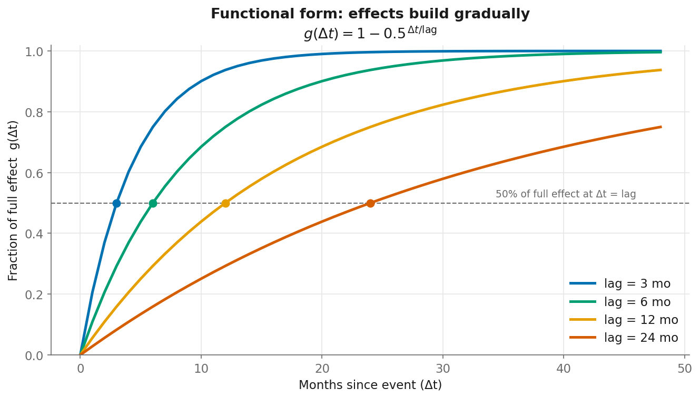

**Combining effects.** Percentage indicators (like ownership) combine additively in percentage points; count indicators (like transactions) compound multiplicatively as percent changes. Effects are measured as an increment relative to an anchor date, so an event already underway isn't double-counted. Purely qualitative "enabling" links (no numeric estimate) are shown in the matrix but kept out of the arithmetic — inventing a magnitude for them would be fabrication.

**The association matrix** answers the headline question — which events move which indicators, and by how much. Colour encodes a unit-free signed strength band; the numbers are native-unit effects.

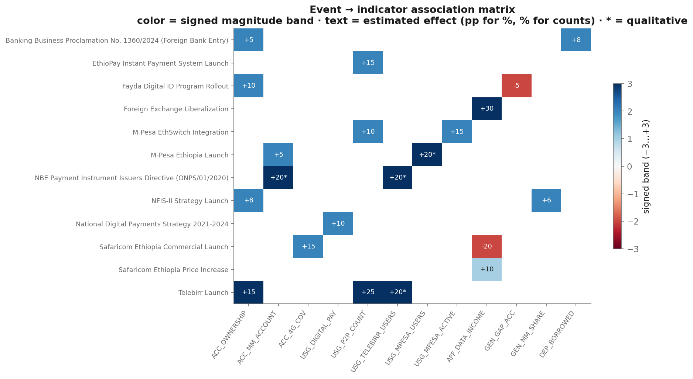

**Validation is where it gets interesting.** Anchoring at 2021 and predicting 2024:

- **Mobile-money account ownership** — predicted **8.9%** vs observed **9.45%**. The M-Pesa `+5pp` estimate reproduces reality almost exactly. No adjustment needed.
- **Account ownership** — predicted **62.7%** vs observed **49%**. The model over-shoots by ~14 points.

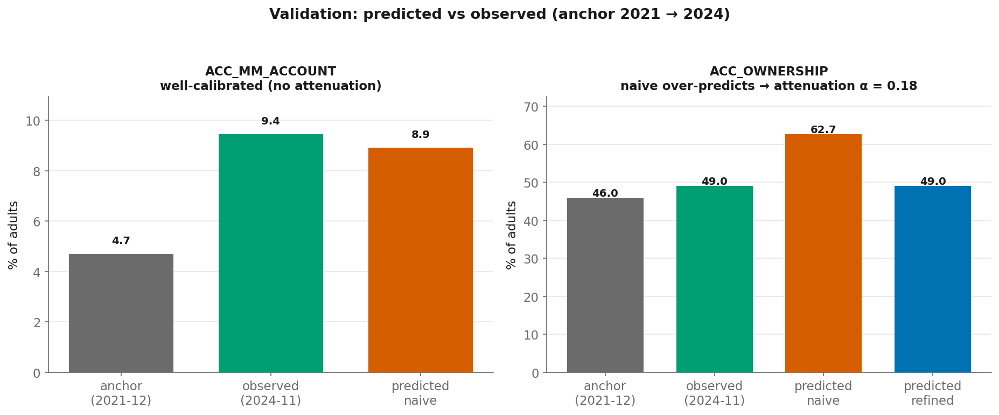

Why the miss? The ownership impacts were borrowed from Kenya and India, where mobile money genuinely *created* new account-holders. In Ethiopia it didn't — it digitised the already-banked. Forcing the model to match reality requires an **attenuation of α ≈ 0.18**: the imported effects realise only about a fifth of their nominal size here. That single number is the paradox, quantified — and it becomes a crucial input to the forecast.

---

## Forecasts for Access and Usage, with uncertainty

With only four Findex points over thirteen years — and clear deceleration — no single method is trustworthy alone, so I combined three: a **linear trend with a 95% prediction interval** (honest but it ignores saturation and over-forecasts), an **event-augmented scenario model** (the central forecast: anchor + organic drift + attenuated event effects), and a **scenario band** for structural uncertainty. Digital payments, with a single data point, are projected as *ownership × payment-propensity* so they inherit the richer ownership curve.

### Account ownership (Access)

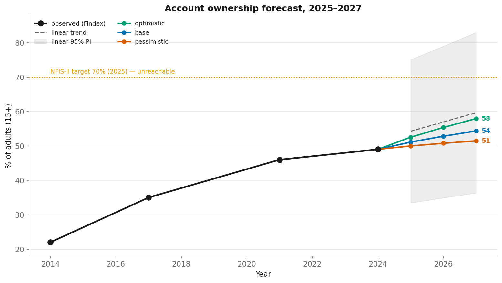

| Year | Pessimistic | **Base** | Optimistic | Linear trend (95% PI) |
|:----:|:-----------:|:--------:|:----------:|:---------------------:|
| 2025 | 50.0 | **51.1** | 52.5 | 54.2 [33.4, 75.1] |
| 2026 | 50.8 | **52.8** | 55.4 | 56.9 [34.9, 79.0] |
| 2027 | 51.5 | **54.4** | 57.9 | 59.7 [36.3, 83.0] |

Base case: **~54% by 2027**. The naive linear fit says ~60%, but it ignores the deceleration the data plainly shows — and its prediction interval ([36, 83] by 2027) is itself an honest confession of how little four points constrain the future. **The NFIS-II 70% target is unreachable**; even the optimistic path is ~58%.

### Digital-payment usage (Usage)

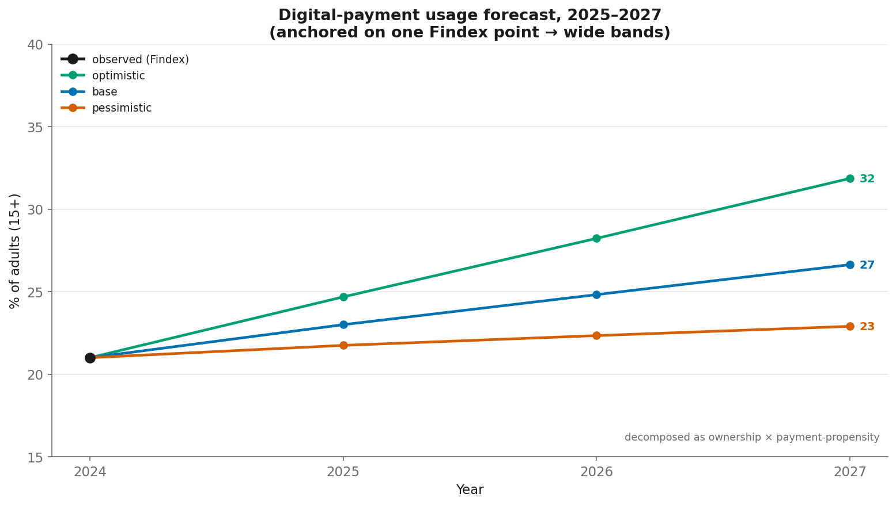

| Year | Pessimistic | **Base** | Optimistic |
|:----:|:-----------:|:--------:|:----------:|
| 2025 | 21.7 | **23.0** | 24.7 |
| 2026 | 22.3 | **24.8** | 28.2 |
| 2027 | 22.9 | **26.6** | 31.9 |

Digital payments grow faster off their low base — to **~27% by 2027** (base) — because the usage frontier is still moving. This is the least certain forecast in the project: it rests on a single Findex observation, so the band is wide and there's no statistical interval, only scenarios.

**Which events matter most?** For *usage*, interoperability — EthioPay instant payments and the M-Pesa–EthSwitch integration — plus the national payments strategy. For *access*, Fayda digital ID and (at long lag) foreign-bank entry, though their ownership effect is attenuated for the reason above. The clearest downside risk is affordability: FX-driven data-cost increases and operator price hikes.

---

## The dashboard

To let stakeholders explore all of this without touching code, the project ships an interactive **Streamlit** dashboard (`streamlit run dashboard/app.py`). It reuses the same modelling engines, so the numbers on screen always match the notebooks. Charts are interactive Plotly, on the same colorblind-safe palette.

**Overview** — headline metric cards, the P2P/ATM crossover gauge, and the growth-deceleration chart:

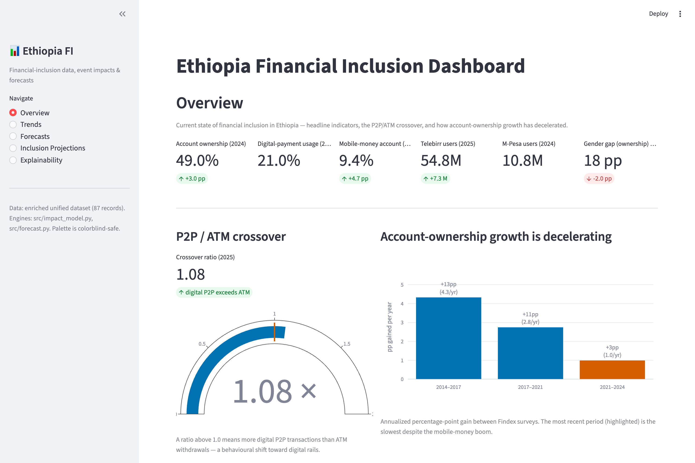

**Trends** — pick indicators, set a year range, and compare channels (P2P vs ATM, Telebirr vs M-Pesa), with a data-download button:

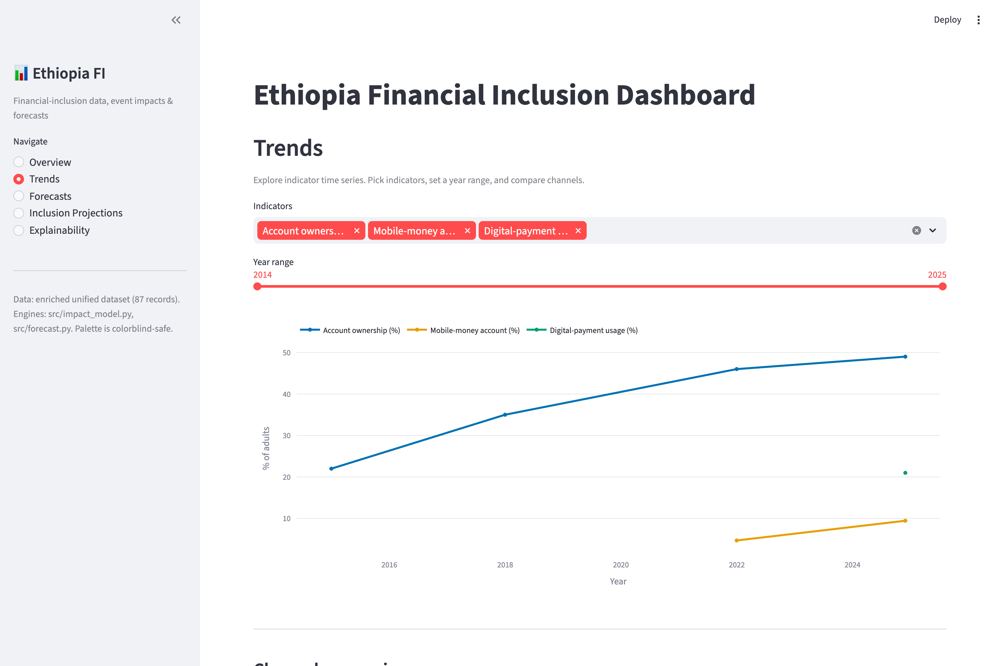

**Forecasts** — scenario and confidence-interval visualisations with a model selector (event-augmented / linear+PI / both), projected milestones, and the association heatmap:

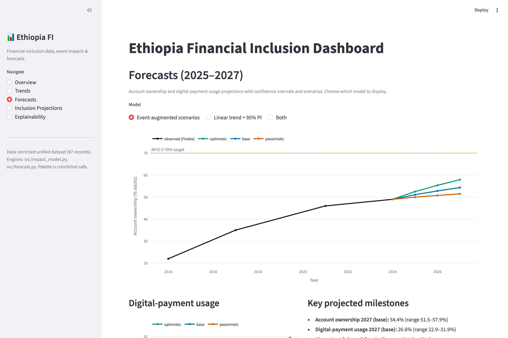

**Inclusion Projections** — a scenario selector, a progress-toward-60%-target gauge, and plain-language answers to the consortium's key questions:

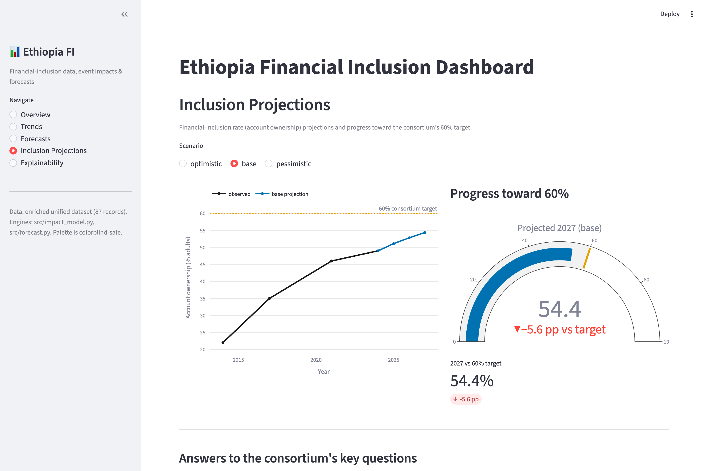

**Explainability** — why the model produced a specific number, and what drives event impact:

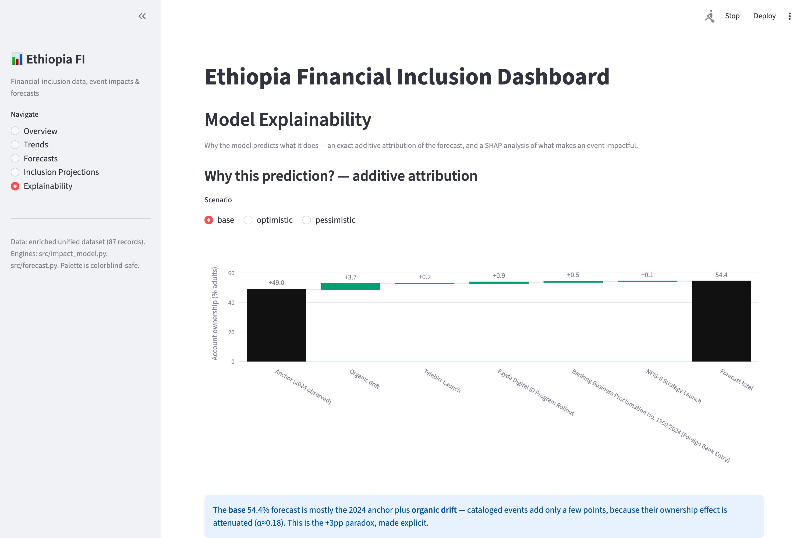

---

## Why the model predicts what it does

A forecast nobody can interrogate is a forecast nobody should act on, so the model is opened up two ways.

**Exact attribution.** The ownership forecast is additive by construction — anchor + organic drift + Σ attenuated event effects — so each component's contribution is exact rather than approximated. The waterfall shows the base 2027 forecast of **54.4%** decomposing into the 49.0% 2024 anchor, **+3.7pp** of organic drift, and only **~1.7pp** from every catalogued event combined:

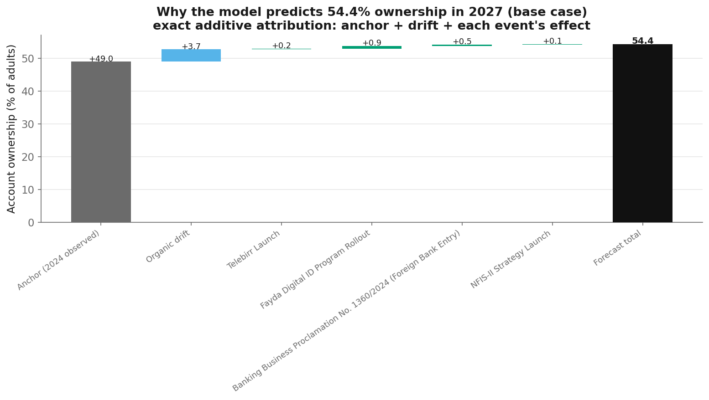

That single chart is the paradox restated as arithmetic: the events we can name explain almost none of the projected gain. The forecast is mostly inertia, which is precisely why 70% by 2025 was never reachable.

**Global drivers (with a caveat that matters).** To ask which *features* make an event impactful, a RandomForest surrogate predicts a link's effect magnitude from its attributes, explained with SHAP:

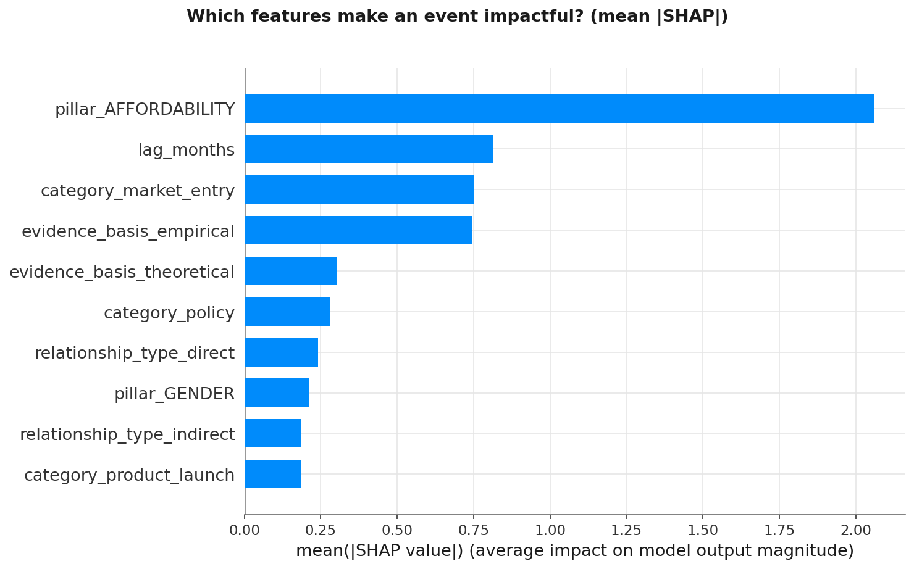

The honest reading is uncomfortable. The strongest predictors of how large an effect a link is credited with are **which pillar it lands on** and **how the estimate was sourced** (`evidence_basis`) — not what the event actually was. Provenance predicting magnitude is a bias signal in the knowledge base, not a finding about Ethiopian households.

Two limits are load-bearing. First, `impact_estimate` is only comparable within a `value_type` — a `percentage` row is percentage points while a `count` row is percent *growth* — so the surrogate is fitted on the 13 pp-denominated links only; regressing across both would let a unit mismatch drive the ranking. Second, 13 curated records cannot support a stable ranking: `pillar_AFFORDABILITY` leads largely because two `AFF_DATA_INCOME` links (+30pp, −20pp) are the most extreme rows in the set. The chart is best read as a map of where the knowledge base is thin, and it is labelled that way in the dashboard.

---

## Limitations and future work

Honesty about limits is part of the analysis, not an afterthought.

- **The data is sparse.** Only 7 of 30 indicators span two or more years; 77% are single-year snapshots. Classical per-indicator time-series methods aren't viable, which is why the work leans on the event structure and comparable-country priors with wide bounds.
- **Non-overlapping years** mean direct cross-indicator correlation would be spurious, so relationships are read from the impact links rather than computed from co-movement.
- **The attenuation factor (α ≈ 0.18) rests on a single calibration interval.** If Ethiopia starts reaching genuinely new users, ownership could rise faster than the base case.
- **Long-lag policies aren't yet observable** — foreign-bank entry, EthioPay, and the M-Pesa–EthSwitch integration are recent or future, so their real magnitudes are untested.
- **The digital-payment forecast rests on one Findex point** — the widest uncertainty in the project.
- **Whole dimensions are unmeasured**: no rural/urban disaggregation, no trust/complaints data, and no measured use-case breakdown (P2P vs merchant vs wages).
- **The SHAP surrogate is illustrative, not inferential.** It is fitted on 13 curated, pp-denominated impact links — enough to audit the knowledge base for bias, nowhere near enough to make claims about which event *types* work.

**Where I'd take it next:** pull the Findex 2025 microdata for rural/urban and youth cuts; add a genuine Telebirr→mobile-money-account link (much of the 2021–2023 growth predates M-Pesa and is currently mis-attributed); bring in NBE complaints data to populate the trust dimension; and — most importantly — track phone and smartphone ownership as leading indicators, because closing the device gap is the single change that would most move Ethiopia's access curve upward.

---

*Reproducibility: the enriched dataset, three notebooks (EDA, impact model, forecast), the `src/` modelling library, and the Streamlit dashboard are all in the project repository, with 75 passing tests running in GitHub Actions CI on every push. Figures use a colorblind-safe palette throughout.*
