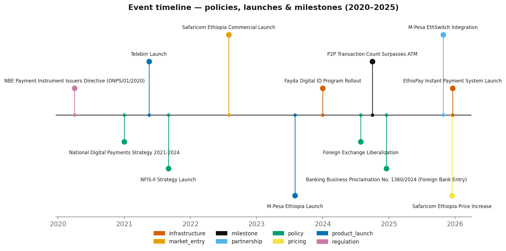
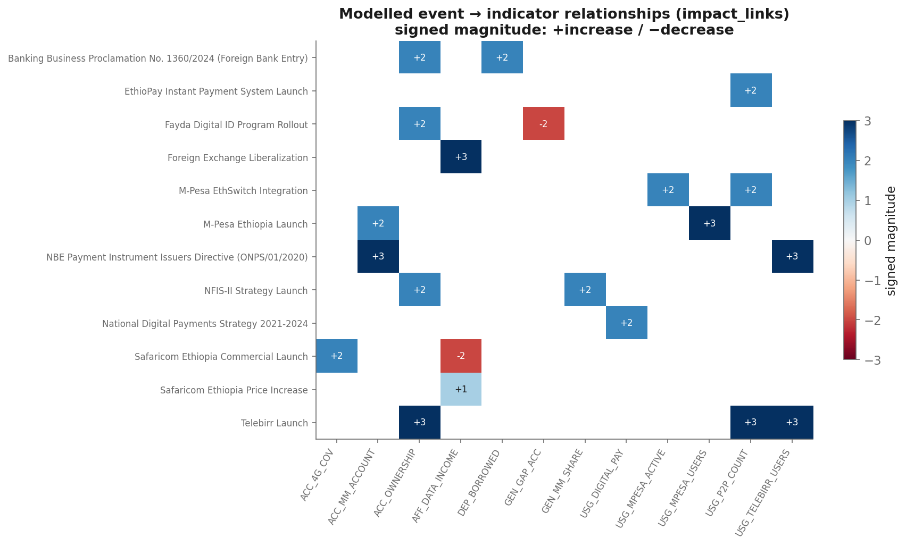

# Ethiopia Financial Inclusion Forecast — Interim Report

**Author:** Yostina Abera
**Date:** 19 July 2026 · **Submission:** Interim
**Scope:** Task 1 (data enrichment) + Task 2 (exploratory data analysis)
**Artifacts:** [enriched dataset](../data/processed/ethiopia_fi_unified_data_enriched.csv) ·
[EDA notebook](../notebooks/01_eda.ipynb) · [figures](figures/) ·
[enrichment log](../data_enrichment_log.md) ·
[key insights](eda_key_insights.md) · [data-quality assessment](data_quality_assessment.md)

---

## Executive summary

Ethiopia's headline account ownership has **stalled at 49% (2024), up only +3pp since 2021**,
even though Telebirr and M-Pesa registered **65M+ mobile-money accounts** over the same period.
This report shows the paradox is not a data error but a **measurement-plus-market-structure**
effect: mobile-money-*only* users are ~0.5%, bank accounts are already easily accessible, so the
registrations largely went to people who already had an account. Meanwhile **usage** has genuinely
shifted digital — P2P transactions overtook ATM withdrawals in 2024→2025. The binding constraint
on further inclusion is now **demand-side** (phone ownership 41%, smartphone 40%), not account
supply. These findings frame the forecasting phase: model **Access** and **Usage** as separate
targets with different drivers, lean on the event/impact-link structure rather than sparse trends,
and carry wide uncertainty bounds.

To support this, the starter dataset was expanded from **57 → 87 records** and one systematic
data-quality defect was corrected.

---

## 1. Data enrichment summary

The starter dataset (57 records) was converted to a single unified CSV, one column-alignment
defect was corrected, and **30 sourced records** were added. Every addition carries a source URL,
an exact quote, a confidence rating and a rationale (full detail in the
[enrichment log](../data_enrichment_log.md)).

| Record type | Starter | Added | Final |
|-------------|:------:|:-----:|:-----:|
| observation | 30 | **+20** | 50 |
| event       | 10 | **+3**  | 13 |
| impact_link | 14 | **+7**  | 21 |
| target      | 3  |  0      | 3  |
| **Total**   | **57** | **+30** | **87** |

**What was added and why** — guided by the *Additional Data Points Guide*:

- **Findex 2025 gender & depth detail** (10 obs) — male/female ownership and phone ownership,
  digital-payment rates, and the first **DEPTH** indicators (36% saved, 4% borrowed). *Why:*
  extends the gender split beyond 2021 and exposes the usage-maturity gap and the very thin
  credit market (Nuance D).
- **Telebirr user time series** (3 obs: 2022–24) — turns a single 2025 point into a **4-point
  adoption curve**. *Why:* the only usable multi-year usage series for trend fitting.
- **Infrastructure & agents** (4 obs) — ATM (10,551) and POS (14,030) counts, ~216,000 mobile-money
  agents, and **314 transactions/agent/year**. *Why:* the acceptance backbone and the "large but
  dormant agent network" nuance; adds the first **QUALITY** signal.
- **Enabler proxies** (3 obs) — smartphone adoption (40%), unique-subscriber penetration (36%),
  electricity access (55%). *Why:* the structural ceilings on how far Access/Usage can grow.
- **3 events** — the **2020 Payment Instrument Issuers Directive** (the legal foundation that made
  Telebirr/M-Pesa possible), the **National Digital Payments Strategy 2021–24**, and the **2024
  foreign-bank proclamation**. *Why:* foundational and structural drivers absent from the starter set.
- **7 impact_links** — wiring the new policy events to the indicators they unlocked, plus two
  **gap-fills** connecting NFIS-II (which had *no* impact_links) to the 70%-ownership and
  50%-women-mobile-money targets it governs.

**Correction applied.** In the starter main sheet, the documentation columns were shifted one
position left — `comparable_country` held the collector name, `collected_by` held a date,
`collection_date` held the source quote. This is corrected losslessly in
`src/build_processed_dataset.py`; the raw file is never edited.

---

## 2. Key insights from EDA (with visualizations)

Full write-up: [`eda_key_insights.md`](eda_key_insights.md). Figures are generated by the tested
engine `src/eda.py` (Okabe-Ito colorblind-safe palette; no dual-axis charts).

### Insight 1 — Account ownership has plateaued despite a mobile-money boom
Ownership rose 22% → 35% → 46% → **49%**, but the annualized gain collapsed from **+4.3pp/yr
(2014–17)** to **+1.0pp/yr (2021–24)** — precisely when Telebirr and M-Pesa launched. The
constraint is no longer account supply.

### Insight 2 — The paradox is a measurement + market-structure artifact
55M Telebirr + 10.8M M-Pesa registrations coexist with Findex mobile-money ownership of just
**9.45%** (~6.6M adults). Because mobile-money-only users are ~0.5% and bank accounts are easily
accessible, most sign-ups went to the **already-banked** — adding a payment channel, not a new
account-holder. Findex counts *any* account, so the registrations are near-invisible to the headline.

### Insight 3 — Registered ≠ active ≠ unique owner
Operator counts overstate inclusion by ~8–10×. M-Pesa's 90-day **active rate is 66%** (7.1M of
10.8M), and agents average **fewer than one transaction per day**.

### Insight 4 — Usage is going digital even though access stalled
P2P transactions grew **49.7M → 128.3M (2024→2025)** and overtook ATM withdrawals (crossover ratio
1.08). Much of this P2P is merchant/commerce activity (Nuance D). The growth frontier has moved from
"open an account" to "transact digitally."

### Insight 5 — The gender gap is device-driven
The account gap narrowed from ~20pp to **15pp** (men 57% vs women 42%), but it tracks a **17pp
phone-ownership gap** (men 50% vs women 33%). Closing the account gap is downstream of closing the
device gap.

### Insight 6 — Demand-side enablers are the ceiling and the best leading indicators
4G coverage nearly doubled (37.5% → 70.8%), yet phone ownership (41%) and smartphone adoption (40%)
lag far behind. Connectivity supply has outrun device demand; **phone/smartphone ownership** are the
tightest near-term ceilings and the most promising leading indicators for the next Findex round.

---

## 3. Preliminary observations on event–indicator relationships

The dataset encodes expected effects as `impact_link` records rather than assuming them. Reading the
relationship matrix alongside the event timeline yields several preliminary observations.

**Did account ownership accelerate after Telebirr (May 2021)?**
No. Ownership was 46% in 2021 and 49% in 2024 — the *slowest* growth phase on record. Telebirr's
measurable effect appears in **usage** (registered users, P2P count), not in **ownership**. This is
the single clearest signal that launches drive usage far more than they drive account creation.

**Did mobile-money accounts grow after M-Pesa entry (Aug 2023)?**
Yes, proportionally: mobile-money account ownership roughly **doubled, 4.7% (2021) → 9.45% (2024)** —
but off a tiny base, so the absolute contribution to any-account ownership is small. M-Pesa's
strongest modelled links are to `USG_MPESA_USERS` and (via EthSwitch integration) `USG_P2P_COUNT`.

**What happened around Safaricom's market entry (Aug 2022)?**
Two opposing forces: competition expanded **4G coverage** (a positive enabler link), while the
**FX liberalization** (Jul 2024) and later Safaricom price increase pushed **data affordability the
wrong way** (`AFF_DATA_INCOME` *increases* = costlier). Affordability is therefore a genuinely
**mixed** driver in this market.

**Structural vs impulse drivers.** The impact_links cluster into two families: fast **direct** effects
(product launches, interoperability → users and P2P volume) and slow **enabling** effects (the 2020
directive, NFIS-II, the National Digital Payments Strategy, Fayda ID, foreign-bank entry → ownership
and depth, with 12–36 month lags). This distinction will shape the intervention terms in the
forecasting model: launches as impulse/step effects on usage, policies as long-lagged level shifts.

**Caveat.** These are *directional* observations. The sparse, non-overlapping time series (Section 4)
mean the *magnitudes* are not yet estimated — that is the job of the impact-modeling phase.

---

## 4. Data limitations identified

Full register: [`data_quality_assessment.md`](data_quality_assessment.md). The values are trustworthy
(~80% high-confidence); the limitations are about **coverage and structure**.

1. **Severe sparsity.** 30 indicators, but only **7 span ≥2 distinct years** (77% are single-year
   snapshots). Only account ownership has real pre-2021 history; everything else clusters in 2024–25.
   → Classical per-indicator time-series methods are not viable; forecasting must use the
   event/impact structure and comparable-country priors with wide bounds.
2. **Non-overlapping years.** The two richest series (ownership 2014/17/21/24; Telebirr 2022–25) share
   only **one** year, so cross-indicator correlation is unreliable and is not reported — relationships
   are read from impact_links instead.
3. **Definitional hazards.** Registered users, survey-reported owners, and 90-day-active users are
   **not interchangeable** and must never share an axis or be differenced (this confusion *is* the
   +3pp paradox). Operator fiscal-year vs Findex calendar-year timing adds minor join error. The
   "unique owners ≈ 6.6M" estimate uses ~70M adults and is order-of-magnitude only.
4. **Coverage gaps.** No rural/urban disaggregation; no pre-2021 mobile-money series; **TRUST** pillar
   has no observations (fraud/complaints unmeasured) and **QUALITY** has just one; no measured
   use-case breakdown (P2P vs merchant vs wages); literacy and urbanization still missing.

---

## 5. Next steps (impact-modeling phase)

Hypotheses to test, carried from the EDA:

1. Operator registrations predict **usage** (P2P volume) far better than **ownership**.
2. **Phone/smartphone ownership** is a stronger leading indicator of Findex ownership than 4G
   coverage — test with a lag.
3. NFIS-II and the 2020 directive act as **enabling** (gradual, long-lag) drivers, not step-changes.
4. Account ownership cannot approach the NFIS-II **70% target** without the phone-ownership gap
   closing first — the ceiling is roughly phone ownership.

The forecasting approach will therefore model Access and Usage separately, use event intervention
terms informed by the impact_links, borrow magnitudes from comparable countries (Kenya, Tanzania,
India), and present all forecasts with explicit confidence bounds appropriate to the data density.
